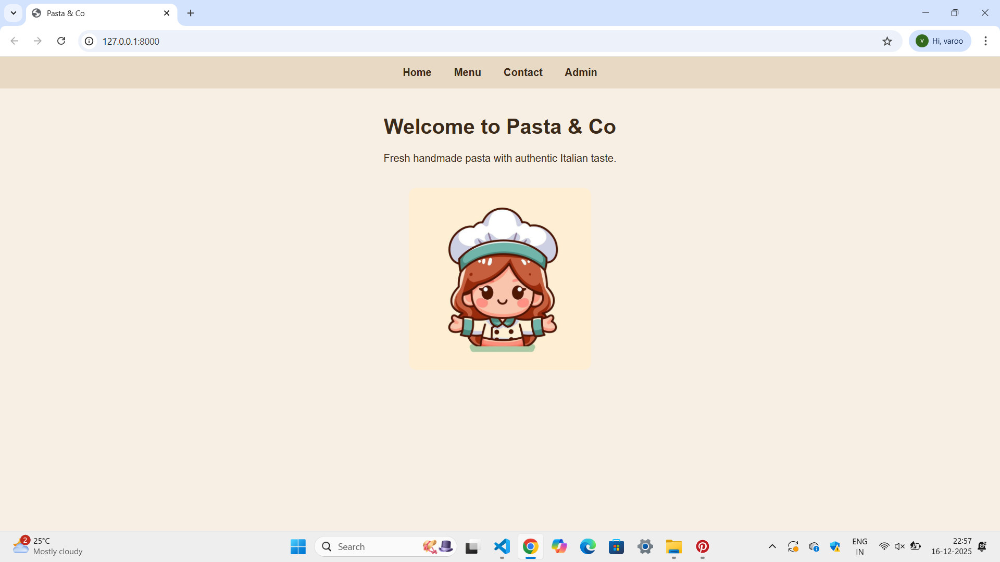
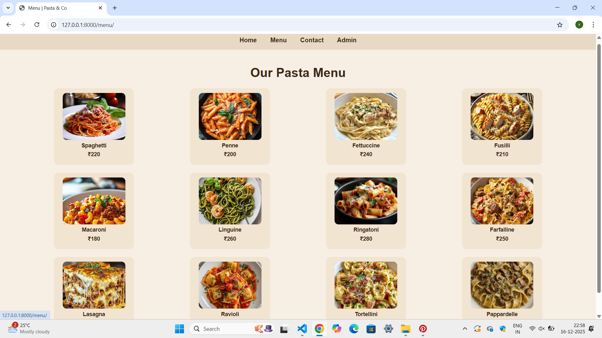
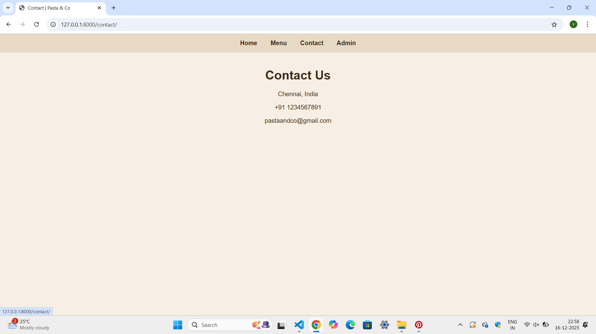
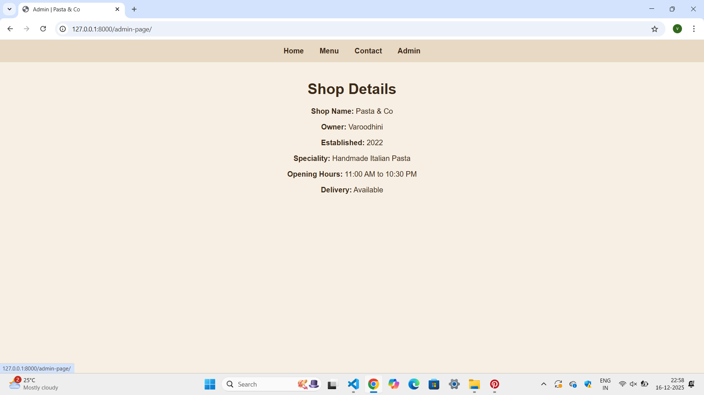

# Ex.06 Restaurant Website
# Date:9-12-25
# AIM:
To develop a static Restaurant website to display the food items and services provided by them.

# DESIGN STEPS:
## Step 1:
Requirement collection.

## Step 2:
Creating the layout using HTML and CSS.

## Step 3:
Updating the sample content.

## Step 4:
Choose the appropriate style and color scheme.

## Step 5:
Validate the layout in various browsers.

## Step 6:
Validate the HTML code.

## Step 7:
Publish the website in the given URL.

# PROGRAM:
home.html
```

<html>
<head>
    <title>Pasta & Co</title>
    <link rel="stylesheet" href="">
</head>
<body>

<nav>
    <a href="">Home</a>
    <a href="">Menu</a>
    <a href="">Contact</a>
    <a href="">Admin</a>
</nav>

<div class="container">
    <h1>Welcome to Pasta & Co </h1>
    <p>Fresh handmade pasta with authentic Italian taste.</p>
    
</div>

</body>
</html>
```
menu.html
```

<html>
<head>
    <title>Menu | Pasta & Co</title>
    <link rel="stylesheet" href="">
</head>
<body>

<nav>
    <a href="">Home</a>
    <a href="">Menu</a>
    <a href="">Contact</a>
    <a href="">Admin</a>
</nav>

<div class="container">
    <h1>Our Pasta Menu</h1>

    <div class="menu-grid">
        <div class="menu-item"><p>Spaghetti</p><p>₹220</p></div>
        <div class="menu-item"><p>Penne</p><p>₹200</p></div>
        <div class="menu-item"><p>Fettuccine</p><p>₹240</p></div>
        <div class="menu-item"><p>Fusilli</p><p>₹210</p></div>
        <div class="menu-item"><p>Macaroni</p><p>₹180</p></div>
        <div class="menu-item"><p>Linguine</p><p>₹260</p></div>
        <div class="menu-item"><p>Ringatoni</p><p>₹280</p></div>
        <div class="menu-item"><p>Farfalline</p><p>₹250</p></div>
        <div class="menu-item"><p>Lasagna</p><p>₹230</p></div>
        <div class="menu-item"><p>Ravioli</p><p>₹270</p></div>
        <div class="menu-item"><p>Tortellini</p><p>₹190</p></div>
        <div class="menu-item"><p>Pappardelle</p><p>₹260</p></div>
    </div>
</div>

</body>
</html>
```
admin.html
```

<html>
<head>
    <title>Admin | Pasta & Co</title>
    <link rel="stylesheet" href="">
</head>
<body>

<nav>
    <a href="">Home</a>
    <a href="">Menu</a>
    <a href="">Contact</a>
    <a href="">Admin</a>
</nav>

<div class="container">
    <h1>Shop Details</h1>

    <div class="admin-box">
        <p><strong>Shop Name:</strong> Pasta & Co</p>
        <p><strong>Owner:</strong> Varoodhini</p>
        <p><strong>Established:</strong> 2022</p>
        <p><strong>Speciality:</strong> Handmade Italian Pasta</p>
        <p><strong>Opening Hours:</strong> 11:00 AM to 10:30 PM</p>
        <p><strong>Delivery:</strong> Available</p>
       
    </div>
</div>

</body>
</html>
```
contact.html
```

<html>
<head>
    <title>Contact | Pasta & Co</title>
    <link rel="stylesheet" href="">
</head>
<body>

<nav>
    <a href="">Home</a>
    <a href="">Menu</a>
    <a href="">Contact</a>
    <a href="">Admin</a>
</nav>

<div class="container">
    <h1>Contact Us</h1>
    <p>Chennai, India</p>
    <p> +91 1234567891</p>
    <p> pastaandco@gmail.com</p>
</div>

</body>
</html>
```
rest.css
```

body {
    margin: 0;
    font-family: Arial, sans-serif;
    background-color: #f7efe3;
    color: #3b2a1a;
    text-align: center;
}

nav {
    background-color: #e8d9c4;
    padding: 15px;
}

nav a {
    text-decoration: none;
    color: #3b2a1a;
    margin: 0 15px;
    font-weight: bold;
}

.container {
    width: 90%;
    margin: auto;
    padding: 20px;
}

.menu-grid {
    display: grid;
    grid-template-columns: repeat(4, 1fr);
    gap: 20px;
    justify-items: center;
}

.menu-item {
    background-color: #f1e4d0;
    padding: 12px;
    border-radius: 12px;
    width: 180px;
}

.menu-item img {
    width: 160px;
    height: 120px;
    object-fit: cover;
    border-radius: 10px;
}

.menu-item p {
    margin: 6px 0;
    font-size: 14px;
    font-weight: bold;
}
.home-img {
    width: 280px;
    height: auto;
    margin-top: 20px;
    border-radius: 12px;
}
```
urls.py
```
from django.contrib import admin
from django.urls import path
from myapp import views

urlpatterns = [
    path('admin/', admin.site.urls),

    path('', views.home, name='home'),
    path('menu/', views.menu, name='menu'),
    path('contact/', views.contact, name='contact'),
    path('admin-page/', views.admin_page, name='admin_page'),
]
```
views.py
```
from django.shortcuts import render

def home(request):
    return render(request, 'home.html')

def menu(request):
    return render(request, 'menu.html')

def contact(request):
    return render(request, 'contact.html')

def admin_page(request):
    return render(request, 'admin.html')
```
# OUTPUT:






# RESULT:
The program for designing software company website using HTML and CSS is completed successfully.
